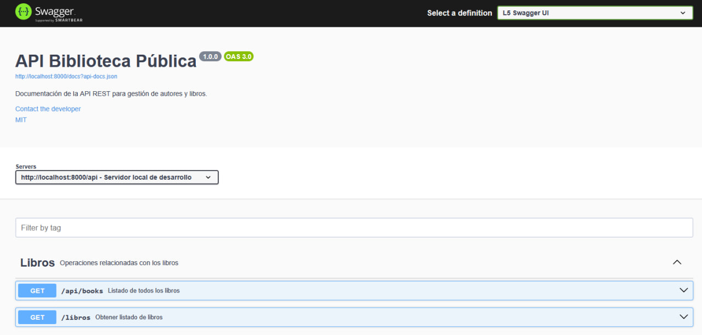
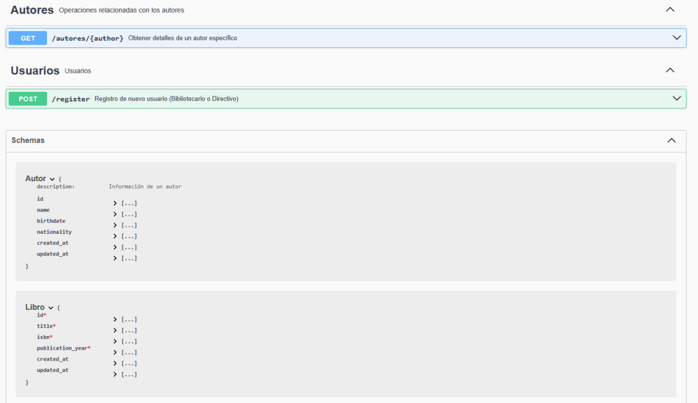
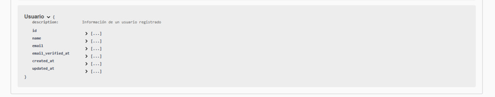

# Qodex 📚

**Qodex** es una API REST desarrollada con Laravel, creada como prueba técnica para la empresa **Qaroni**.  
Permite la gestión de libros y autores en una biblioteca digital, incluyendo autenticación por roles, exportación de estadísticas y un panel administrativo moderno con FilamentPHP.  
El entorno está completamente **dockerizado** para un despliegue rápido y profesional.

✅ Por simplicidad, todos los usuarios que se registren desde el formulario serán bibliotecarios.
✅ Solo un admin (ya dentro de Filament) podrá cambiar manualmente a "directivo" si es necesario.
✅ Así evitamos riesgos de que cualquier persona se autoproclame directivo desde fuera.

---

## 📝 Requisitos previos

Antes de comenzar, asegúreate de tener instalado:

- [Docker](https://docs.docker.com/get-docker/)
- [Docker Compose](https://docs.docker.com/compose/)
- [Make](https://www.gnu.org/software/make/)

### ℹ️ Instalar Make en Windows

En Windows, Make no viene instalado por defecto. Puedes instalarlo utilizando:

- **Chocolatey**:
  ```bash
  choco install make
  ```

- **Scoop**:
  ```bash
  scoop install make
  ```

También puedes usar WSL2 si prefieres un entorno Linux completo en Windows.

---

## 🚀 Tecnologías utilizadas

- Laravel 10
- PHP 8.2 (FPM)
- MySQL 8
- Docker & Docker Compose
- Nginx
- FilamentPHP
- Laravel Excel
- Swagger (documentación en progreso)

---

## 🧱 Estructura del proyecto

```
QODEX/
├── docker/
│   ├── nginx/
│   │   └── default.conf
│   └── php/
│       └── Dockerfile
├── .gitignore
├── docker-compose.yml
├── Makefile
├── LICENSE
├── README.md
└── src/ (código Laravel local)
```

---

## ⚙️ Pasos para levantar el entorno

### 1. Clonar el repositorio

```bash
git clone https://github.com/tuusuario/qodex.git
cd qodex
```

### 2. Construir y levantar los contenedores

```bash
make up
```

### 3. Instalar Laravel dentro del contenedor

```bash
make install
```

### 4. Configurar el entorno

Editar `.env`:

```
DB_CONNECTION=mysql
DB_HOST=mysql_db
DB_PORT=3306
DB_DATABASE=laravel
DB_USERNAME=laravel
DB_PASSWORD=secret
```

Generar la clave de aplicación:

```bash
make artisan key:generate
```

### 5. Acceso a la aplicación

```text
http://localhost:8000
```

Deberías ver la página de bienvenida de Laravel.

### 6. Instalación de FilamentPHP (panel de administración)

```bash
make filament-install
```

Acceder a:

```text
http://localhost:8000/admin
```

Para crear un usuario administrador:

```bash
make artisan make:filament-user
```

### 7. Instalación de Spatie Laravel-Permission (gestión de roles)

```bash
make spatie-install
```
---

## 📚 Documentación de la API

Este proyecto incluye documentación automática de los endpoints públicos usando **Swagger** gracias a L5-Swagger.

- **URL para visualizar la documentación**:  
  👉 [http://localhost:8000/api/documentation](http://localhost:8000/api/documentation/default)

- **Endpoints documentados**:
  - Listado de Libros públicos
  - Detalles de Autores públicos
  - Registro de nuevos usuarios (Bibliotecarios y Directivos)

- **Modelos disponibles en la especificación**:
  - **Libro** (`Book`)
  - **Autor** (`Author`)
  - **Usuario** (`User`)

- **Formato de la documentación**: OpenAPI 3.0.0

- **Servidor de desarrollo**: `http://localhost:8000/api`

### Capturas de la documentación Swagger

> 

> 

> 
---

> ⚡ **Nota**: Recuerda regenerar la documentación cuando modifiques las anotaciones ejecutando:
> ```bash
> php artisan l5-swagger:generate
> ```


---

## ⚡ Automatización con Make

```text
make up                # Levanta los contenedores\make install           # Instala Laravel desde cero
make migrate           # Ejecuta las migraciones
make seed              # Ejecuta los seeders
make down              # Detiene y elimina los contenedores
make restart           # Reinicia el entorno
make artisan <cmd>     # Ejecuta comandos artisan
make bash              # Accede al contenedor
make logs              # Ver los logs del contenedor
make fix-perms         # Repara permisos en Laravel
make export-src        # Copia el código del volumen a ./src
make pull-code         # Copia el código desde ./src al volumen Docker
make filament-install  # Instala FilamentPHP
make spatie-install    # Instala Spatie Laravel-Permission
make refresh           # Ejecuta fresh migrations + seeders
```

---

## ✅ Funcionalidades previstas

- Gestión de usuarios con roles diferenciados (Directivo, Bibliotecario, Anónimo).
- CRUD de libros y autores (relación muchos a muchos).
- Panel administrativo con FilamentPHP.
- Exportación de datos en Excel.
- Documentación de endpoints con Swagger.
- Sistema de autenticación y registro de usuarios.

---

## 📋 Notas adicionales

- Laravel vive en el volumen `qodex_laravel` pero el código se sincroniza con `./src` para poder editar localmente.
- Utiliza `make export-src` para copiar el contenido del volumen Docker a `./src`.
- Utiliza `make pull-code` para aplicar cambios hechos en `./src` al volumen.
- Usa `make fix-perms` si encuentras errores de permisos.

---

## 💪 Autor y créditos

Desarrollado por **ikikidev** como parte del proceso de selección técnica para **Qaroni**.

---

